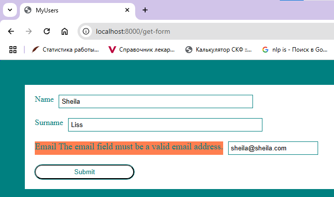
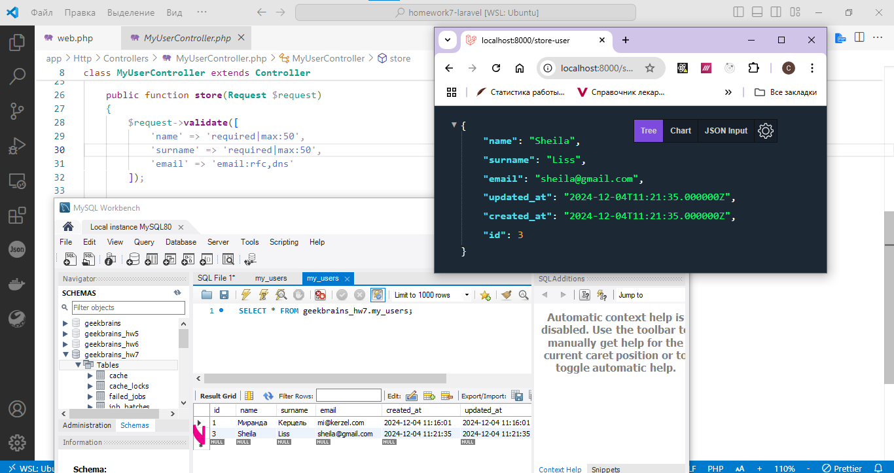
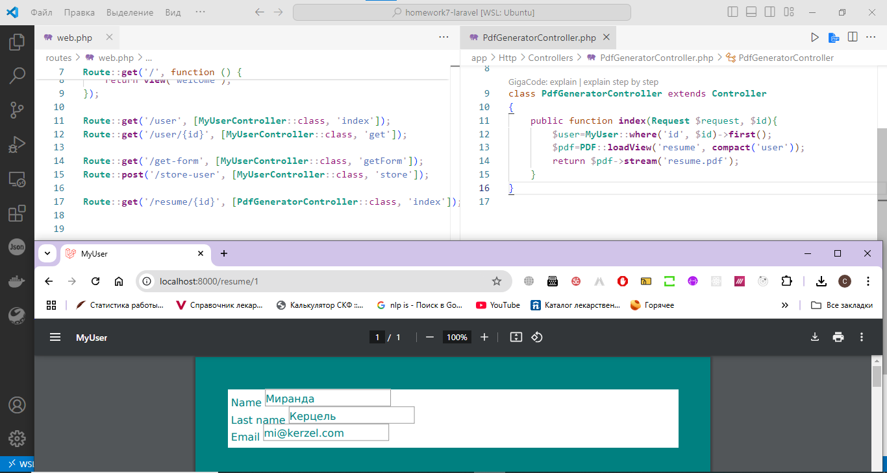

# Laravel. Homework 7. Тогочакова Евгения

В этой практической работе вы будете разрабатывать контроллер, который позволит выводить информацию об одном и обо всех пользователях из базы данных, 
сохранять данные о новом пользователе в БД, а также создавать PDF с информацией о пользователе.
1. Установите новое приложение Laravel и настройте подключение к базе данных. 
Добавьте необходимые переменные окружения в ENV-файл корневого каталога приложения.

2. Создайте новую модель Eloquent c помощью команды:
```
php artisan make:model User -mfsc
```
Напомним, что флаг -mfsc создаст модель, наполнитель, контроллер и файл миграции.
После опишите схему базы данных в методе up() файла .app/Http/Models/User.php.

После описания схемы таблицы базы данных запустите миграцию.

3. Создайте необходимые роуты в файле web.php. Ваше приложение должно содержать минимум четыре эндпоинта:
— для получения всех пользователей из БД;
— получения одного пользователя через id, переданный в параметрах роута;
— записи нового пользователя в базу данных;
— получения данных о пользователе в виде PDF-файла.

4. Создайте новый blade-шаблон. В blade-шаблоне создайте форму, которая будет отправлять данные о работнике. 
Важно, чтобы поля HTML-формы были сопоставимы с полями таблицы базы данных. 
При отправке запроса экземпляр класса request должен содержать данные об имени, фамилии и адресе электронной почты пользователя.
Форма blade-шаблона должна содержать CSRF-токен, поля формы должны быть обязательны к заполнению (используйте атрибут required).

5. В контроллере UserController.php опишите функцию store, которая будет сохранять данные из вашей HTML-формы. Добавьте валидацию.

Дополнительно. Добавьте валидацию на количество символов (максимальное количество символов — 50) для полей Name и Surname. 
Для почты добавьте валидацию в виде регулярного выражения на соответствие виду example@mail.com.

6. Добавьте соответствующие методы index и get, которые будут возвращать данные обо всех пользователях и об одном пользователе по переданному id. 
Опционально можете возвращать ответ в формате JSON.

7. Чтобы генерировать PDF-документ, вам понадобится DOMPDF-пакет, который является сторонней библиотекой. Для его установки выполните команду:
```
composer require barryvdh/laravel-dompdf

```

— В файле composer.json добавьте строку с указанным пакетом.
— Запустите команду composer update.
— Добавьте необходимый Service Provider и Facade в файл config/app.php.


8. Создайте новый контроллер для работы с PDF:
```
php artisan make:controller PdfGeneratorController
```

9. Опишите функцию index, которая будет возвращать новый PDF-файл.


10. Измените роут Route::get('/resume') таким образом, чтобы он принимал id в виде параметра. Обновите функцию «index» так, чтобы 
PDF формировался на основе данных из таблицы по переданному id.



